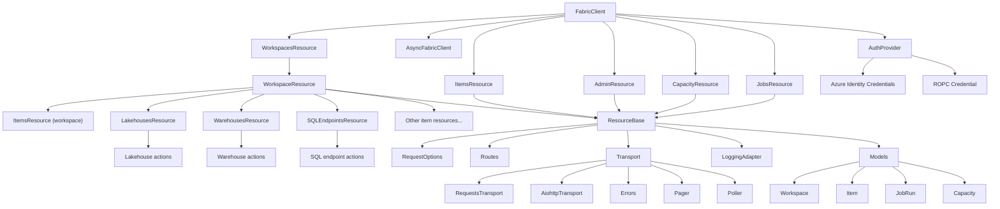

# Architecture

This document describes the target SDK architecture for FabRest.

## Public SDK Surface
- `FabricClient` and `AsyncFabricClient` are the main entry points.
- Top-level resources are exposed as properties (workspaces, items, admin, capacity, jobs).
- Workspace-scoped resources are accessed via `client.workspace(id)`.

## Resources
- Each resource class exposes CRUD and action methods with sync/async parity.
- Workspace resources provide access to item-specific sub-resources.
- Item resources may expose action methods and sub-collections (e.g., tables, restore points, schedules, sessions).
- Preview/beta endpoints are exposed explicitly (either via named methods or flags) and documented in the method docstrings.

## Routing
- `Routes` centralizes endpoint construction and validation.
- Existing URL helpers can remain as a compatibility layer that calls `Routes`.

## Transport
- `Transport` owns sessions, timeouts, and retry/throttling behavior.
- Requests and aiohttp are isolated behind transport implementations.

## Errors
- A single error hierarchy maps HTTP responses to SDK exceptions.
- Error parsing is centralized and consistent for sync/async.

## Pagination and LRO
- `Pager` provides lazy iteration and aggregated list helpers.
- `Poller` manages long-running operations with `wait` and `result` APIs.
- Long-running behavior is controlled via `RequestOptions` on resource methods rather than per-resource polling logic.

## Models
- Lightweight TypedDict models (no new dependencies) for payload interfaces and parsed responses.
- Default return type is parsed data; `raw_response=True` returns the transport response.
- Payload interfaces are generated from Fabric Swagger specs and exposed under `fabrest/models`.

## Auth
- Token handling lives in `AuthProvider`.
- Scopes are derived centrally based on credential type.
